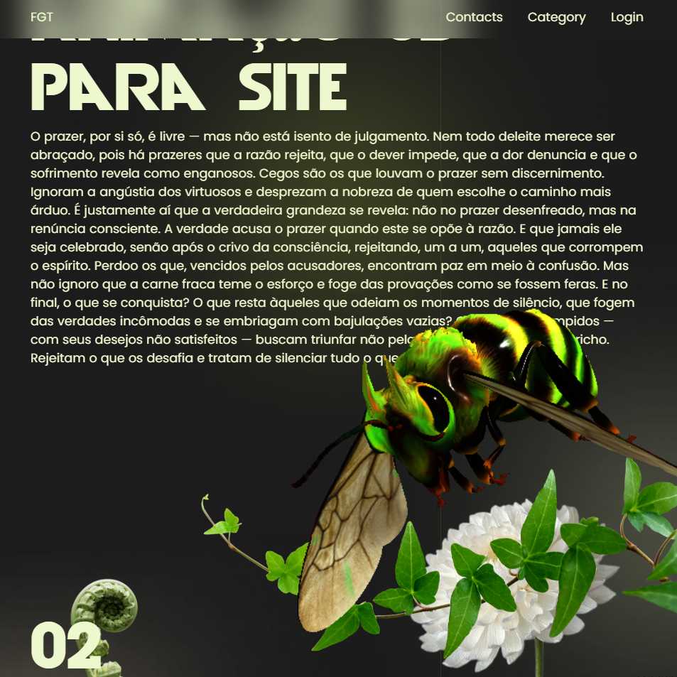

# 🐝 ABELHA 3D INTERATIVA - Projeto Web

Este projeto apresenta uma experiência visual imersiva com uma **abelha 3D animada**, utilizando **Three.js** e **GLTFLoader** para renderização WebGL, com integração de movimento sincronizado à rolagem da página via **GSAP**. Ideal para portfólios criativos, apresentações visuais e interfaces interativas com foco em design e inovação.

## 🚀 Tecnologias Utilizadas

- [Three.js](https://threejs.org/) — Motor de renderização 3D WebGL
- [GLTFLoader](https://threejs.org/docs/#examples/en/loaders/GLTFLoader) — Loader para modelos `.glb` / `.gltf`
- [GSAP](https://greensock.com/gsap/) — Biblioteca de animações
- HTML5 + CSS3 — Layout, responsividade e estilo
- Modelo 3D (.glb) hospedado via [GitHub Raw](https://raw.githubusercontent.com/)

## 📁 Estrutura do Projeto

.
├── index.html # Página principal com estrutura, script e integração 3D
├── style.css # Estilos visuais, fontes, responsividade e decoração
└── README.md # Documentação do projeto

markdown
Copiar código

## 🎨 Funcionalidades

- **Modelo 3D Animado**: Abelha com animação contínua carregada via `GLTFLoader`.
- **Interação com Scroll**: A posição e rotação do modelo se alteram dinamicamente conforme o usuário rola a página.
- **Layout Responsivo**: Ajusta-se automaticamente para dispositivos móveis e desktops.
- **Design Imersivo**: Estética floral e tipografia personalizada (Devil Breeze, Poppins).

## 📌 Como Executar Localmente

1. Clone o repositório:
   ```bash
   git clone 
Acesse o diretório:

bash
Copiar código
cd 
Abra o index.html no navegador:

Pode simplesmente arrastar o arquivo para o navegador ou utilizar um servidor local com Live Server (VSCode recomendado).

🌐 Pré-requisitos
Nenhuma instalação de dependências via Node.js é necessária, pois o projeto utiliza CDNs para carregar as bibliotecas externas.

📷 Captura de Tela




📞 Contato
Tipo	Contato
Email	ftesorie123@gmail.com
Telefone	+55 46 99928-2899
GitHub	Fernando-Gabriel-Tesori

🧠 Observações Finais
O modelo .glb utilizado está hospedado com cabeçalhos CORS apropriados no GitHub.

A lógica de movimentação do modelo 3D é baseada em seções HTML identificadas por id, tornando a personalização simples e direta.

Este projeto é ideal para aplicações onde estética e interatividade 3D são diferenciais.

Projeto baseado em Den no CodePen, adaptado com inovações visuais e estruturais.
